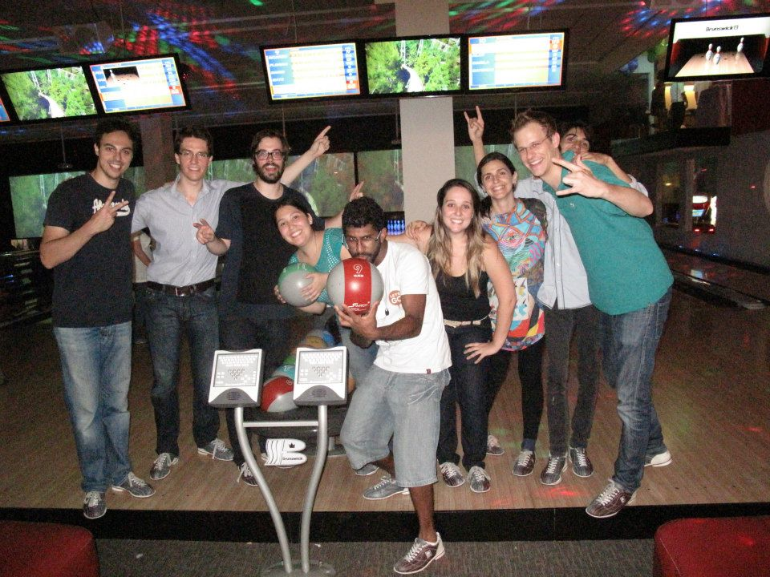
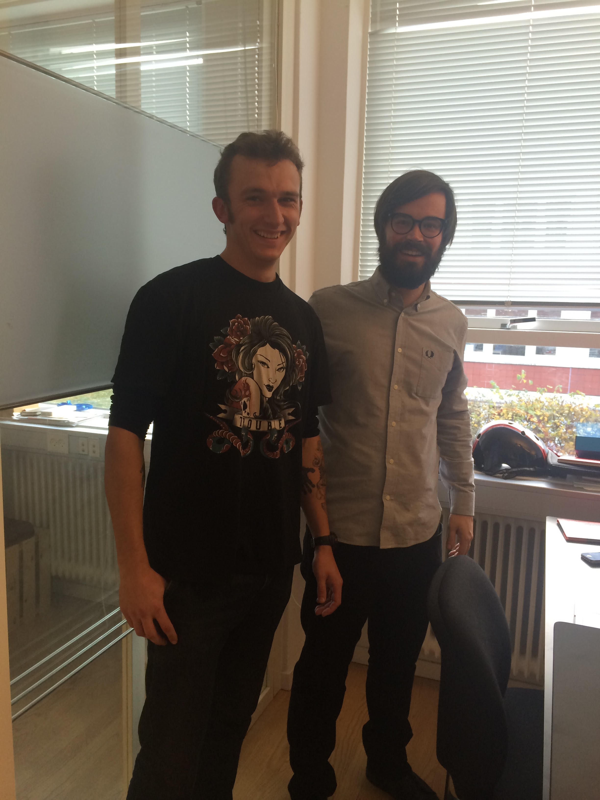
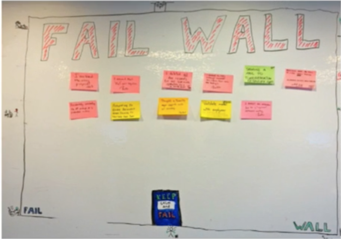
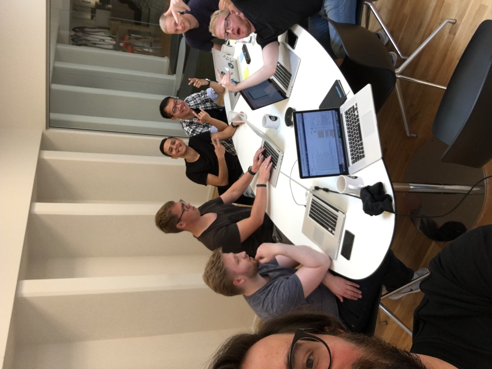
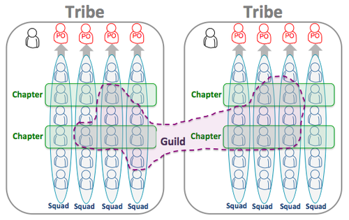

# [fit] Building 
# [fit] _winning tech teams_
## [fit] that disrupt the status quo

---

---

### [fit]_@ricardoparro_
### [fit] #ricardopleasestoptalkingaboutfootballasyouaretheonlyportugueseintheroom

---

# [fit] London, Wonga.com and Jonty Hurwitz

---

# São Paulo and Printi.com

---

# The Hitchhiker Developer

---

# Learnings

---

#  Product Development Process
## _Epics_
## _User Stories_

---

# Product Development Process
## _Functional Specs_
## _Technical Specs_
### [Joel on Software - Painless Functional Specifications](http://www.joelonsoftware.com/articles/fog0000000036.html)

---

# Product Development Process
## _Good product managers clearly define product requirements -- in writing_
### [Good Product Manager, Bad Product Manager by Ben Horowitz and David Weiden](http://www.khoslaventures.com/wp-content/uploads/Good_Product_Manager_Bad_Product_Manager_KV.pdf)

---

#  Product Development Process Enables
## _Motivation_
## _Velocity_
## _Quality_

---

# Data Driven Product Development 
## _Short feedback loops_
## _Iterative_ 
## _Better, faster decisions_

---

# Data Driven Product Development 
## _Assumptions_
## _Ego_

---

# Development Process
## _Scrum_
## _Incremental_ 
## _Small releases_

---

# Development Process
## _Non bureaucratic_
## _Simple as possible_
## _Silent_

---

# CI/CD
## _Automation_
## _Silent_

---

# Testing
## _Automated_
## _Usability and Manual_
## _Environments_

---

# Team Mission

---

# Talent and Diversity

---

# Consistency

## _Marathon composed of sprints_

---

# Controlled Chaos
## _Single point of contact_
## _"Closed door policy"_
## _Communication_

---

# Embracing Change
## _Comfort Zone_
## _Force Changes_

---

# Fail Friendly Environment
## _Toggle feature_
## _Celebrate failure_

---

#Fail Wall

---

# Lean startup
## _Retrospectives_

---

#Two Pizza Team Rule

---

---

# Enter Tradeshift

---

#  Risk Team

---

# Business Analytics Team

---

# Experiment - Chapters

---

# Teams Structure at Spotify

---

# What Tradeshift offers

---

# Hard problems to solve

---

# [fit] Being part of a company 
# [fit] that is changing the world

---

# [fit] Connect all companies in the
# [fit] _World_

---

# _We Hack_

---

# _We are hiring!_ 

---

#Questions?

---

# Interesting Resources
## _Leaders eat last - Simon Sinek_
## _Extreme Ownership - Jocko willink_
## _Spotify Engineering culture videos_
