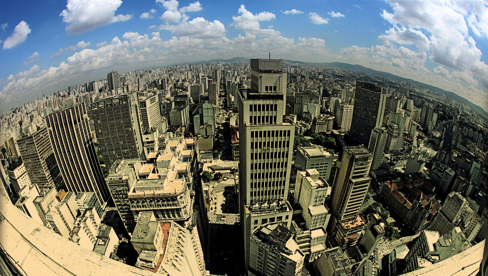

# [fit] Building 
# [fit] _winning tech teams_
## [fit] that disrupt the status quo

^
Thanks for coming
Intro
People as an important component to build software
So who watch the match on Sunday?

---

^
Leadership, strategy, tenacity and focus led them to victory and this is the magic about teams. 
Sometimes with a team of avaerage individuals you can achieve greatness. 
Devices out?

---

### [fit]_@ricardoparro_
### [fit] #ricardopleasestoptalkingaboutfootballasyouaretheonlyportugueseintheroom

---

# [fit] London, Wonga.com and Jonty Hurwitz

^
wonga history
mentor jonty
lead team of 10 devs
after the founder left company became more corporate
jonty is an investor and artist

---

# São Paulo and Printi.com

^
Printi Story
Photo - Small team
Wife as PM and involvement with product
Lean startup

---

# Learnings

---

# Product Development Process
## _Functional Specs_
## _Technical Specs_
### [Joel on Software - Painless Functional Specifications](http://www.joelonsoftware.com/articles/fog0000000036.html)

^
Starts with an idea
Epics to stories
Stories to Functional specs
Developers happiness = how long they are focused just on coding
Technical Specs
Joel on Software

---

# Data Driven Product Development 
## _Short feedback loops_
## _Iterative_ 
## _Better, faster decisions_

^
Qualitative Data
Quantitative Data
Tools
Short feedback loop, iterations , decisions
Hard Work

---

# Data Driven Product Development 
## _Assumptions_
## _Ego_
## _Context_ 

^ The main goal for this is to remove assumptions and ego. Ultimately the engineers will be much more happier when they understand why they are implementing certain feature. Does this make sense? 

---

# Development Process
## _Non bureaucratic_
## _Simple as possible_
## _Silent_

^
scrum
transparency
rule of thumb 
black box

---

# Team Mission

^ Each team should have it's own mission within the company. This will help the team be dedicated and focused on a important vision.
^ This is important to create engagement and a sense o purpose.

---

# Talent and Diversity

^ personalities
^ talent
^ country cultures
^ Not always the team with the best players win

---

# Consistency

## _Marathon composed of sprints_

---

# Controlled Chaos
## _Single point of contact_
## _"Closed door policy"_
## _Communication_

^
team leader and the protector of the team

---

# Embracing Change
## _Outside of Comfort Zone_
## _Force Changes_

---

# Fail Friendly Environment
## _Toggle feature_
## _Celebrate failure_

---

#Fail Wall

^ One of the ideas I tried in the past is to have a fail wall where the team can state what features and projects went completely south and what did we learn with those experiences. I think ackowledging the fact that we are always learning and that we do mistakes unites the team members and creates a team spirit. 

---

# Lean startup
## _Retrospectives_

^
A waste repelent culture is necessary 
Retrospectives are scrum ceremonies

---

---

# Team Structure
## Feels like a "mini startup"
## Self Organizing
## Takes ownership

^
The perfect team for me has all elements necessary to ship a quality product. 
The PM, PO and designer should work closely with the team.

---

# Teams Structure

---

# Enter Tradeshift

---

#  Risk Team

---

# Business Analytics Team

---

# What Tradeshift offers

---

# Hard problems to solve

---

# [fit] Connect all companies in the
# [fit] _World_

---

# _We Hack_

---

# _We are hiring!_ 

---

#Questions?

---

# Interesting Resources
## [_Leaders eat last_](http://www.amazon.co.uk/gp/product/0670923168/ref=as_li_tl?ie=UTF8&camp=1634&creative=6738&creativeASIN=0670923168&linkCode=as2&tag=talk-ts-21)
## [_Good Product Manager, Bad Product Manager_](http://www.khoslaventures.com/wp-content/uploads/Good_Product_Manager_Bad_Product_Manager_KV.pdf)
 
## [_Spotify Engineering culture videos_](https://vimeo.com/85490944)

---

# Interesting Resources
## [_The hard thing about hard things_](http://www.amazon.co.uk/gp/product/0062273205/ref=as_li_tl?ie=UTF8&camp=1634&creative=6738&creativeASIN=0062273205&linkCode=as2&tag=talk-ts-21)
## [_Joel on Software_](http://www.amazon.co.uk/gp/product/1590593898/ref=as_li_tl?ie=UTF8&camp=1634&creative=6738&creativeASIN=1590593898&linkCode=as2&tag=talk-ts-21)
## [_Smart and get things done_](http://www.amazon.co.uk/gp/product/1590598385/ref=as_li_tl?ie=UTF8&camp=1634&creative=6738&creativeASIN=1590598385&linkCode=as2&tag=talk-ts-21)
