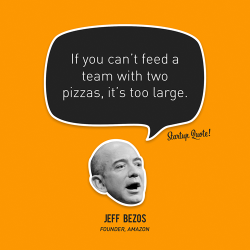
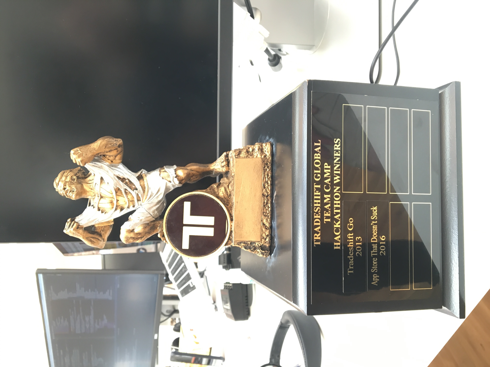

# [fit] Building 
# [fit] _winning tech teams_
## [fit] that disrupt the status quo

^ Who watch the match on Sunday? §

---

^ I am portuguese and I was proud to see a team acknowledging that they were not the best team but they worked together
^ in order to be able to win in such adversity. Leadership, strategy, tenacity and focus led them to victory and this is
^ the magic about teams. Sometimes with a team of avaerage individuals you can achieve greatness. I am so happy and proud for their win 
^ and what this means for my country. So enough about football. Let's talk about tech teams.
^ Do you guys have your devices out? 
^ I see you do, so if you want to tweet about this talk or you want to ask me any question afterwards
^ please use § my handle and this hashtag

---

### [fit]_@ricardoparro_
### [fit] #ricardopleasestoptalkingaboutfootballasyouaretheonlyportugueseintheroom

---

# [fit] London, Wonga.com and Jonty Hurwitz

^ I was so fortunate to get my first full time job at a startup that was disrupting the fintech space back in 2007 right before the
^ economic meltdown. I told my mom that I was going on holidays for a couple of weeks to London (of course in my mind I had other plans)
^ but maybe because I was afraid of failure I did not tell the truth. 
^ And the truth was that I had some interviews for junior developer position. 
^ One at myspace.com and another at wonga.com. I got a job at Wonga and I bombed out the interview at myspace. Looking back I am glad that I did not pass the interview at myspace
^ This event defined what I am today as a professional
^ I have been focused on disrupting offline and oldschool industries like credit, printing and supply management
^ I saw Wonga.com going from 7 people (2 devs) to 1 Billion dollar valuation in 2 years and a half and during that time 
^ I was lucky to be mentored by the CTO and co-founder of Wonga Jonty Hurwitz that taught me out to be aware of the dynamics of teams and how software
^ is much about people and less about code
^ He also helped me come out of my shell and practise leadership and help teams reaching success. 
^ He gave me the oportunity of leading a team of 10 developers and with that I became hooked to buidling tech teams. 
^ Wonga became more corporate after the original founder left the company and I moved on. After wonga my mentor Jonty became an Investor and an artist. He is know by sculpting the smallest sculptures in the world. They are as small as an hair and you can only see them whith a microscope. You should check him out as it is interesting how he uses technology to make art.

---

# São Paulo and Printi.com

^ Later on I had the opportunity to move to São Paulo because a part time project I had that became a serious business. Long story short 2 german guys approached me and asked me if I wanted to help them building a online printing system for an idea they had that aimed the brazillian market that was very hot at that time. I said yes and I started coding on my part time in my bedroom. Once we launched printi we got some initial traction and that got the attention of some silicon valley investors. So after this the founder called and asked me if I wanted to join them to continue what I have started and to build a tech team from scratch as a CTO. This was the forst time I was responsible to build and lead a team of developers. 
^ As you see on the photo we were a very small team and it was definitely a very rewarding experience because after 3 years working on the project an american company called vista print bought the company and it became a business case in Brazil. 
^ During this time my wife was a product manager in my team and I was heavily exposed to the product development process thanks to her. That experience helped me to understand how to build products from an idea to implementation and how to improve that product along the way while having a motivated team that was productive in a consistent way. Also was exposed to the lean startup because hiring in Brazil is extremely difficult and beaurocratic so we relied heavily in automation using technology as oposed of hiring more people.

---

# The Hitchhiker Developer

^ Fast foward some years and I came to work in Copenhagen for another startup and I had a wow moment. Because the lack of funds I had to hire remote developers in Ukraine. One of those developers after 6 month on the job was not performing as it was expected and unfortunatelly I had to fire him. After I fired him this developer tells me I am going to Copenhagen to see you. This is someone I never met in person in my life... Oh man I was scared because I did not understand why he was coming. And he hitchhiked part of the way to copenhagen. I think he did Prague to Berlin because he did have much money to come here.
^ So we met in the office because I was completly in the dark. He did not tell me why he wanted to see me. He comes in and we started to talk and he said to me. Ricardo thanks so much for being patient all of these months and to show me what is to work in a good team where people are appreciated and are engaged and motivated to achieve a goal. It was a special moment. 

---

# Learnings

---

#  Product Development Process
## _Ideas_
## _Epics_
## _User Stories_

^ I learned that in order to build a winning tech team the product process needs to be done well and with quality. That starts usually with an idea. From that idea you can generate several epics and each epics will give birth to diferent users stories. This is all dandy. But the difficult part is

---

# Product Development Process
## _Functional Specs_
## _Technical Specs_
### [Joel on Software - Painless Functional Specifications](http://www.joelonsoftware.com/articles/fog0000000036.html)

^ To be able to translate those ideas, epics and stories into a more concrete format which I call Functional Specs and Technical Specs.
^ Functional Specs are documents that define exactly what needs to be achieved, to the detail, on the usability level. You can include here low fidelity wireframing and define exactly what needs to be done. This is a responsability of the Product manager to drive but it can be a tech team effort together with the product manager to come out with a spec that is detailed enough in order to start implementation without hickups and with maximum speed. Most teams get this wrong. I saw startups fail in the past because of this. The specs where not up to standart the tech team was to blame and then the team started to become not motivated and slow due to the uknowns when a task was being implemented. 
^ In my opinion what makes developers happy is to have well defined work so they can focus a good chunk of hours on implementing quality work.
^ Technical Specs are needed when the work at hand involves critical technical decisions that can affect the systems scalability. Not all tasks need this.
^ If you are interested in this plese have a look at Joel on Software blog posts about functional specs. They are extremely valuable.

---

# Product Development Process
## _Good product managers clearly define product requirements -- in writing_
### [Good Product Manager, Bad Product Manager by Ben Horowitz and David Weiden](http://www.khoslaventures.com/wp-content/uploads/Good_Product_Manager_Bad_Product_Manager_KV.pdf)

^ Again very important. Good product managers cleary define product requirements in writing. So important. I worked with some PMs in my past that did not know the power of writing clear simple specs that are understand by everybody in the team.
^ Please take a look at a very interesting paper written by Ben Horowitz and David Weiden. Who here knows Ben Horowitz - raise your hand. He has a fantastic book about startups called the Hard Thing about the Hard Things. For me that book is a bible on startups.
^ So a tech team needs to have a good PM or PO working closely that helps to raise the quality of the specs.

---

#  Product Development Process Enables
## _Motivation_
## _Velocity_
## _Quality_

^ So in summary a good product development enables good things in a tech team. Motivation because developer will not be dragged into a hole while they are trying to implement some feature. Velocity because the tasks belonging to a sprint will be clear and the estimation will be more accurate and of course quality of the deliver. 

---

# Data Driven Product Development 
## _Short feedback loops_
## _Iterative_ 
## _Better, faster decisions_

^ Once you have the first ideas for the product that product needs to be improved. In order to make decisions about what to build and what to improve, what colors to use what design to apply qualitative and quantitative data is needed. You can use tools like Datadog, mixpanel, qualaroo, crazy egg , kissmetrics, google analytics to capture that data. This means that you can start having short feedback loops and therefore the team becomes a master in iterative work. Also this will enable better and faster decisions

---

# Data Driven Product Development 
## _Assumptions_
## _Ego_
## _Context_ 

^ The main goal for this is to remove assumptions and ego. Ultimately the engineers will be much more happier when they understand why they are implementing certain feature. Does this make sense? 

---

# Development Process
## _Scrum_
## _Incremental_ 
## _Small releases_

^ So following the product process comes the Development process. 
^ I believe that scrum makes tech teams preform better and creates transparency. It's a very simple process that used in a good way can help teams getting success. Incremental development and small releases help a team to be more confident on what they release and also to be more quick to fix any problems that may appear. A good rule of thumb for scrum process is that anyone in the company at any time can look at a scrum board and understand what the team is working on and can dive into the details of it.

---

# Development Process
## _Non bureaucratic_
## _Simple as possible_
## _Silent_

^ When I see companies having one guy dedicated only to be scrum master I cringe. If you have someone looking at the process for 8 hours a day for sure the process will be bureaucratic, complex and not silent and will become a problem. I truly believe that a scrum master should be a developers or team leads job to do and should not take a huge amount of time once the process is in place and running. Ultimately shoud be the tech team responsability to make the process better and raise any problems that the process may have.

---

# CI/CD
## _Automation_
## _Silent_

^ Automation of the deployment process. Should be something that the developers are not worried about and that does not create noise.
^ The goal should be for the tech team to be focused on delivering value for the company as much time as possible

---

# Testing
## _Automated_
## _Usability and Manual_
## _Environments_

^ Offcourse Automated, Usability and Manual testing are important in order to capture problems that the product may have and to give confidence to the team that the code that is being introducing is not creating problems. A good automation of testing coverage increases the productivity and identifies errors right at the beggining of the process.

---

# Team Mission

^ Each team should have it's own mission within the company. This will help the team be dedicated and focused on a important vision.
^ This is important to create engagement and a sense o purpose.

---

# Talent and Diversity

^ Talent and diversity is very important. Specially diversity of personalities. Having 2 senior devs in a team that are amazing but have tough personalities can be a problem. Saw teams with 7 senior devs that were producing less than a team of 3 average devs. The same happens in football. Not always the team with the best players win. The best teams are the teams that have the right mixture of personalities. 

---

# Consistency

## _Marathon composed of sprints_

^ It's not worst to push a team to the limit in one single sprint. In a longer term perspective this does not work and affects the outcome in ways that are not immediatelly perceived. Pushing a team to the limit create friction and frustration. It's like training a muscle. The teams that become better at doing estimation and measure of effort are the teams that will win over a period of time. This is a fact. 

---

# Controlled Chaos
## _Single point of contact_
## _"Closed door policy"_
## _Communication_

^ How to control chaos that is inerent specially in startups. Well I am a true believer on the single point of contact specially during crunch hours or focused hours. If is an open space this single point of contact should be considered the door for that team. Offcourse there is a balance because teams need to communicate between each other but is something that the single point of contact can do. Usually this should be done by the team leader. Dealing with PM requests, stakeholders questions, etc. This enables focus on the tasks at hand without being interrupted. This is one of the most important things in Tech Teams. If the developers are being interrupted all the time nothing will get done.
^ The single point of contact should protect the team of distraction and also make sure that the team on important things that add real value to the company

---

# Embracing Change
## _Outside of Comfort Zone_
## _Force Changes_

^ Naturally in a fast growing startup changes happen naturally but as a team lead in confortable moments I try to make changes so the team trains the adaptability to different scenarios. This is important because developers get bored easily so if things are too predictable and they are working on something that they do not find challenging sometimes change is needed. That can be in the form of introducing something different in the dev process or simply involving the developers more in the product development process. Sometimes even changing places. 

---

# Fail Friendly Environment
## _Toggle feature_
## _Celebrate failure_

---

#Fail Wall

---

# Lean startup
## _Retrospectives_

---

#Two Pizza Team Rule

---

---

# Teams Structure at Spotify

---

# Enter Tradeshift

---

#  Risk Team

---

# Business Analytics Team

---

# What Tradeshift offers

---

# Hard problems to solve

---

# [fit] Being part of a company 
# [fit] that is changing the world

---

# [fit] Connect all companies in the
# [fit] _World_

---

# _We Hack_

---

# _We are hiring!_ 

---

#Questions?

---

# Interesting Resources
## _Leaders eat last - Simon Sinek_
## _Extreme Ownership - Jocko willink_
## _Spotify Engineering culture videos_
